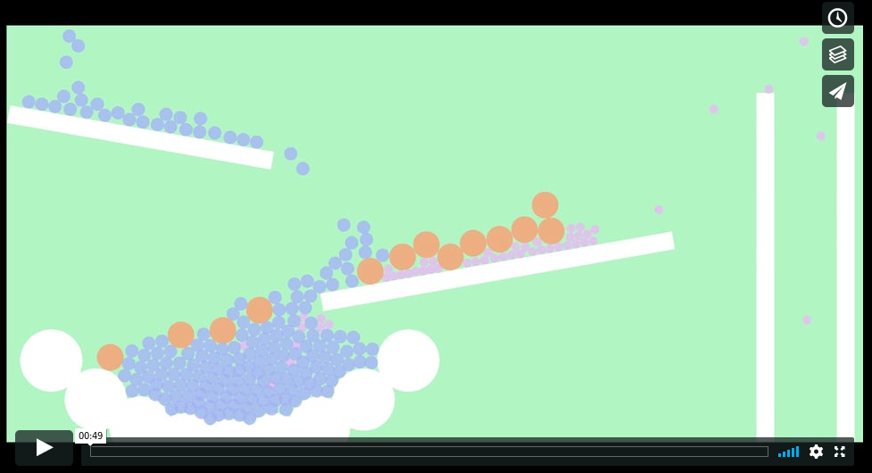

# impulse-rs

This is a port of [Randy Gaul's Impulse Engine](https://github.com/RandyGaul/ImpulseEngine). Impulse is a really
simple physics engine that has circle and polygon shapes, with collision and contact resolution. It doesn't have
more advanced features like springs or composite bodies, but it is simple enough that you can implement these
yourself, if needed.

This project is not a library, but a program that uses the engine. The engine itself is decoupled from the 
renderer so adapting this for something else is easy.

# what it looks like

# building

## sdl dependency

[ggez](https://github.com/ggez/ggez) is used for rendering and the version used for this project requires the
SDL2 libraries. This is explained by SDL2 crate [here](https://github.com/Rust-SDL2/rust-sdl2#user-content-requirements).

## rust

You will need to install the rust toolchain to run the project, [rustup](https://rustup.rs/) is the recommended method.

Once that's done, call `$ cargo run --release` in the project folder.

# work in progress

This is still a work in progress, if you find any bugs please feel free to open an issue or send a pull request.
